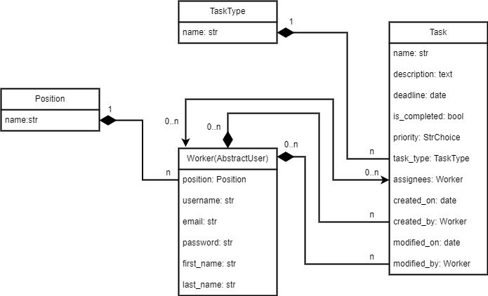

# It Company Task Manager

Django Project for managing tasks

## Check this out!

[Task Manager project deployed to render.com](https://it-company-task-manager-itp8.onrender.com)

## Installation

Python3 must be already installed

```shell
git clone https://github.com/IvanMayor/it-company-task-manager.git
cd it-company-task-manager
python -m venv venv
source venv/Scripts/activate
pip install -r requirements.txt
python manage.py runserver  # starts Django server
```

- You can Login as superuser:
  - Login: 'Admin-user'
  - Password: 'Admin-user12345'

## Features


* Authentication functionality for Worker/User
* Managing Tasks workers positions task-types


## Demo

- Data base structure:


- Login page:


- Home page:


- Worker list page:


- Worker detail page:


- Worker create view page:


- Worker update position view page:


- Worker delete view page:


- Task list view page:


- Task detail view page:


- Task create view page:


- Task update view page:


- Task type list view page:


- Task type update view page:


- Position list view page:

